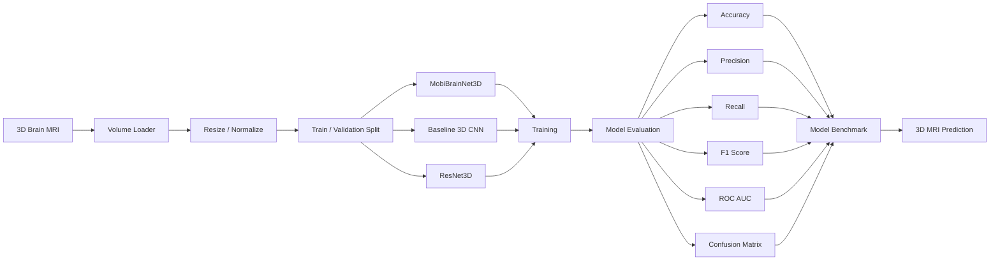

<div align="center">


<br>

# 🧠 3D MobiBrainNet

### Multi-Model Deep Learning for 3D Alzheimer's Disease Classification

<p>
A modular research-oriented deep learning framework for
<strong>3D brain MRI classification</strong>, comparing a lightweight
<strong>MobiBrainNet</strong> architecture against conventional
<strong>3D CNN</strong> and <strong>3D ResNet-style</strong> models.
</p>

<br>


<br>

**3D MRI • Deep Learning • Neuroimaging • Alzheimer's Disease • Model Benchmarking**

</div>

---

> **Visual note:** The project banner above is a conceptual visualization. Any example metrics shown inside the banner are illustrative and should not be interpreted as measured experimental results. Use the evaluation outputs generated by this repository for actual model performance.

---

## ✨ Overview

Alzheimer's disease is a progressive neurological disorder associated with structural changes in the brain.

Magnetic Resonance Imaging **(MRI)** provides detailed three-dimensional anatomical information that can be explored computationally using modern deep learning techniques.

**3D MobiBrainNet** is designed as a reproducible experimental framework for comparing multiple neural-network architectures directly on volumetric brain imaging data.

Instead of treating MRI scans as disconnected 2D slices, the project supports **three-dimensional volume processing**, allowing a model to learn spatial relationships across depth, height, and width.

The overall research pipeline is:

```text
3D Brain MRI
     ↓
Volume Loading
     ↓
Preprocessing
     ↓
Normalization
     ↓
3D Deep Learning
     ↓
Multi-Model Benchmarking
     ↓
Classification
     ↓
Performance Analysis
```

---

# 🎯 Project Objectives

The primary objectives are to:

* 🧠 Explore deep learning for volumetric brain MRI analysis
* 🔬 Build an end-to-end 3D classification pipeline
* ⚡ Develop a lightweight **MobiBrainNet-style 3D architecture**
* 🧱 Compare lightweight and conventional 3D CNN architectures
* 📊 Evaluate models using multiple classification metrics
* 🧪 Provide reproducible training and evaluation scripts
* 📈 Generate publication-style performance visualizations
* 🔍 Support single-volume inference
* 🧩 Maintain a clean and extensible research-code structure

---

# 🏷️ Classification

The reference implementation is configured for three neurological categories:

| Class      | Description               |
| ---------- | ------------------------- |
| 🟢 **CN**  | Cognitively Normal        |
| 🟡 **MCI** | Mild Cognitive Impairment |
| 🔴 **AD**  | Alzheimer's Disease       |

The class configuration can be changed inside:

```text
src/config.py
```

and through the dataset folder structure.

---

# 🧠 Why 3D Deep Learning?

Traditional image classification models generally operate on two-dimensional images.

MRI scans are naturally **volumetric**.

A 3D representation contains spatial information across:

```text
Width × Height × Depth
```

A 3D convolutional architecture can therefore learn patterns across neighboring slices rather than processing each slice independently.

```text
                     3D MRI Volume
                          │
                          ▼
              ┌─────────────────────┐
              │  3D Convolutions    │
              │                     │
              │ X-axis              │
              │ Y-axis              │
              │ Z-axis              │
              └─────────┬───────────┘
                        │
                        ▼
                Volumetric Features
                        │
                        ▼
                 Classification
```

---

# ⚡ MobiBrainNet

The repository includes a lightweight **MobiBrainNet3D-style architecture** built around efficient 3D convolutional blocks.

The objective is to reduce unnecessary computation while preserving the ability to extract volumetric representations.

### Core ideas

* 3D depthwise convolution
* Pointwise `1×1×1` convolution
* Batch normalization
* Efficient channel expansion
* Global average pooling
* Lightweight classification head
* Reduced parameter count compared with larger 3D CNNs

### Conceptual block

```text
Input Volume
     │
     ▼
3D Convolution
     │
     ▼
Depthwise 3D Conv
     │
     ▼
1 × 1 × 1 Pointwise Conv
     │
     ▼
BatchNorm + ReLU
     │
     ▼
Feature Expansion
     │
     ▼
Global Average Pooling
     │
     ▼
Classifier
```

---

# 🧩 Models Included

## 1. MobiBrainNet3D

A lightweight architecture designed for efficient volumetric feature extraction.

```text
Input
  ↓
Stem Conv
  ↓
Mobile 3D Block
  ↓
Mobile 3D Block
  ↓
Mobile 3D Block
  ↓
Adaptive Pooling
  ↓
Dropout
  ↓
Classifier
```

---

## 2. Baseline 3D CNN

A conventional volumetric CNN used as a baseline.

```text
MRI
 ↓
Conv3D
 ↓
MaxPool3D
 ↓
Conv3D
 ↓
MaxPool3D
 ↓
Conv3D
 ↓
Global Pool
 ↓
FC
```

---

## 3. ResNet3D

A residual 3D architecture containing skip connections.

```text
Input
 ↓
3D Stem
 ↓
Residual Block
 ↓
Residual Block
 ↓
Residual Block
 ↓
Global Average Pool
 ↓
Classifier
```

Residual connections can make deeper models easier to optimize by allowing information to bypass intermediate transformations.

---

# 🏗️ Complete Architecture



---

# 📁 Repository Structure

```text
3D-MobiBrainNet-Alzheimers-Classification/
│
├── .github/
│   └── workflows/
│       └── bootstrap-project.yml
│
├── assets/
│   ├── 3d-mobibrainnet-dashboard.png
│   ├── confusion_matrix.png
│   ├── roc_curves.png
│   └── training_curves.png
│
├── configs/
│   └── default.yaml
│
├── dataset/
│   ├── AD/
│   ├── MCI/
│   └── CN/
│
├── models/
│   └── .gitkeep
│
├── notebooks/
│   └── alzheimer_multimodel_experiment.ipynb
│
├── outputs/
│   └── .gitkeep
│
├── src/
│   ├── __init__.py
│   ├── config.py
│   ├── data.py
│   ├── models.py
│   ├── train.py
│   ├── evaluate.py
│   ├── predict.py
│   └── utils.py
│
├── tests/
│   └── test_models.py
│
├── .gitignore
├── requirements.txt
├── pyproject.toml
└── README.md
```

---

# 📦 Supported Volume Formats

The reference data loader supports:

```text
.npy
.nii
.nii.gz
```

For NIfTI files, the repository uses **NiBabel**.

---

# 📂 Dataset Layout

Organize the data as:

```text
dataset/
│
├── AD/
│   ├── subject_001.nii.gz
│   ├── subject_002.nii.gz
│   └── ...
│
├── MCI/
│   ├── subject_101.nii.gz
│   └── ...
│
└── CN/
    ├── subject_201.nii.gz
    └── ...
```

You can also use `.npy` 3D volumes.

---

# ⚙️ Preprocessing Pipeline

Each MRI volume passes through:

```text
Raw 3D Volume
      ↓
Load MRI
      ↓
Convert to Float32
      ↓
Remove NaN / Inf
      ↓
Z-Score Normalization
      ↓
Resize to Fixed 3D Shape
      ↓
Optional Training Augmentation
      ↓
Tensor [C, D, H, W]
```

Default input dimensions:

```text
96 × 96 × 96
```

They can be modified depending on available GPU memory.

---

# 🚀 Installation

## 1. Clone

```bash
git clone https://github.com/Hamza-code-hub/3D-MobiBrainNet-Alzheimers-Classification.git

cd 3D-MobiBrainNet-Alzheimers-Classification
```

---

## 2. Create Environment

### Windows

```bash
python -m venv .venv
.venv\Scripts\activate
```

### Linux / macOS

```bash
python3 -m venv .venv
source .venv/bin/activate
```

---

## 3. Install Dependencies

```bash
pip install -r requirements.txt
```

---

# 🏋️ Train a Model

### MobiBrainNet

```bash
python -m src.train \
    --data dataset \
    --model mobibrainnet \
    --epochs 30
```

### 3D CNN

```bash
python -m src.train \
    --data dataset \
    --model cnn3d \
    --epochs 30
```

### ResNet3D

```bash
python -m src.train \
    --data dataset \
    --model resnet3d \
    --epochs 30
```

---

# 📊 Evaluation

Evaluate a trained checkpoint:

```bash
python -m src.evaluate \
    --data dataset \
    --checkpoint models/mobibrainnet_best.pt
```

The evaluation pipeline calculates:

* Accuracy
* Precision
* Recall / Sensitivity
* F1-Score
* Confusion Matrix
* One-vs-Rest ROC curves
* ROC-AUC
* Class-level statistics

---

# 🔍 Single MRI Prediction

```bash
python -m src.predict \
    --checkpoint models/mobibrainnet_best.pt \
    --volume example_scan.nii.gz
```

Example terminal format:

```text
Model: MobiBrainNet3D

Prediction
────────────────────────────────
Class       : MCI
Confidence  : 87.42%

Probabilities
────────────────────────────────
AD          : 7.14%
MCI         : 87.42%
CN          : 5.44%
```

---

# 📈 Experimental Outputs

Evaluation automatically stores generated results inside:

```text
outputs/
```

Potential outputs include:

```text
outputs/
├── metrics.json
├── classification_report.txt
├── confusion_matrix.png
├── roc_curves.png
└── training_history.json
```

---

# 📊 Model Benchmark

Do not hard-code performance claims into the README before running the experiments.

After training, report measured values here:

| Model           | Accuracy | Precision | Recall |  F1 | ROC-AUC | Parameters |
| --------------- | -------: | --------: | -----: | --: | ------: | ---------: |
| MobiBrainNet3D  |      TBD |       TBD |    TBD | TBD |     TBD |       Auto |
| Baseline 3D CNN |      TBD |       TBD |    TBD | TBD |     TBD |       Auto |
| ResNet3D        |      TBD |       TBD |    TBD | TBD |     TBD |       Auto |

This keeps the repository scientifically honest and reproducible.

---

# 🧪 Reproducibility

The project includes:

* Fixed random seeds
* Saved model configuration
* Reusable dataset loader
* Reproducible train/validation splits
* Checkpoint management
* Machine-readable metrics
* Modular model definitions
* Automated tests

---

# 🔬 Research Applications

Potential research areas include:

### 🧠 Neuroimaging

Studying structural patterns in volumetric brain MRI.

### 🤖 Medical Artificial Intelligence

Developing and benchmarking deep-learning methods for neuroimaging research.

### ⚡ Efficient 3D Networks

Exploring lightweight architectures where computation and memory are constrained.

### 📊 Model Benchmarking

Comparing different families of volumetric neural networks under a common evaluation pipeline.

### 🔍 Explainable AI

Extending the project with techniques such as:

```text
3D Grad-CAM
Occlusion Sensitivity
Saliency Maps
Feature Visualization
```

---

# 🛣️ Roadmap

* [x] Modular 3D model architecture
* [x] MobiBrainNet3D
* [x] Baseline 3D CNN
* [x] ResNet3D
* [x] NIfTI support
* [x] NumPy volume support
* [x] Training pipeline
* [x] Evaluation pipeline
* [x] Single-volume inference
* [x] Confusion matrix generation
* [x] ROC analysis
* [ ] 3D Grad-CAM
* [ ] Cross-validation
* [ ] External dataset validation
* [ ] TensorBoard integration
* [ ] MLflow experiment tracking
* [ ] ONNX export
* [ ] Docker deployment
* [ ] Streamlit research demo
* [ ] Vision Transformer comparison
* [ ] 3D Swin Transformer comparison

---

# ⚠️ Medical & Research Disclaimer

> This repository is intended strictly for **research, engineering experimentation, and educational use**.

The software has not been validated as a medical device and must not be used independently for diagnosis, treatment selection, patient management, or other clinical decision-making.

Clinical use would require rigorous external validation, assessment of dataset bias and generalization, regulatory review, security and privacy controls, explainability analysis, prospective testing, and oversight by qualified healthcare professionals.

---

# 🔐 Privacy

Medical imaging data can contain sensitive information.

Before using MRI datasets:

* Follow applicable privacy requirements
* Remove identifying metadata where appropriate
* Follow the dataset's license and data-use agreement
* Do not commit patient scans to a public repository
* Keep private clinical datasets outside Git tracking

The default `.gitignore` excludes the local dataset directory.

---

# 🤝 Contributing

Contributions are welcome for:

* New 3D architectures
* Data-processing improvements
* Additional metrics
* Explainability methods
* Testing
* Documentation
* Deployment tooling

Recommended workflow:

```bash
git checkout -b feature/my-improvement

git add .

git commit -m "feat: add new improvement"

git push origin feature/my-improvement
```

Then open a pull request.

---

# ⭐ Support

If this repository helps your research or learning:

### ⭐ Star the repository

### 🍴 Fork it

### 🧪 Experiment with new models

### 🤝 Contribute improvements

---

<div align="center">

# 🧠 + 🧬 + 🤖

### 3D Neuroimaging × Deep Learning × Efficient AI

**Building reproducible tools for intelligent volumetric medical-image research.**

<br>

Made for **AI • Deep Learning • Computer Vision • Medical Imaging Research**

</div>
