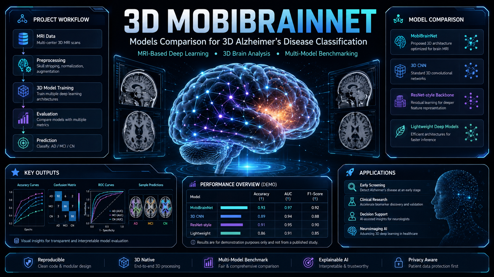
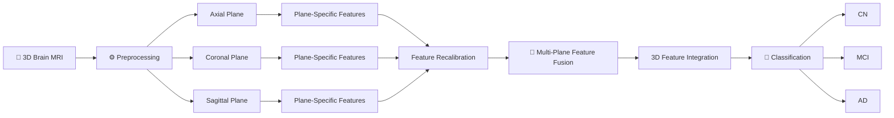

<div align="center">



<br>

# 🧠 3D-MobiBrainNet

### Multi-Class Alzheimer's Disease Classification using 3D Brain Magnetic Resonance Imaging

<p>
<strong>Official research implementation and reproducible deep-learning project</strong><br>
for multi-class Alzheimer's disease classification from volumetric brain MRI.
</p>

<br>

[](https://doi.org/10.1016/j.asej.2025.103714)
[](https://doi.org/10.1016/j.asej.2025.103714)
[](https://doi.org/10.1016/j.asej.2025.103714)
[](https://doi.org/10.1016/j.asej.2025.103714)

<br>


<br>

### `97.33% Accuracy` • `97.41% Precision` • `97.33% Recall` • `97.33% F1` • `99.92% AUC`

<br>

**3D MRI • Multi-Plane Feature Fusion • Depth-Wise Separable CNN • Neuroimaging • Alzheimer's Disease**

</div>

---

> [!IMPORTANT]
> **Published Research:** This project is associated with the peer-reviewed research article
> **“3D-MobiBrainNet: Multi-class Alzheimer's disease classification using 3D brain magnetic resonance imaging”**
> published in **Ain Shams Engineering Journal — Elsevier, 2025**.
> DOI: **[10.1016/j.asej.2025.103714](https://doi.org/10.1016/j.asej.2025.103714)**

> [!NOTE]
> The hero artwork at the top of this README is a conceptual visualization created for project presentation. Performance values in the scientific sections below are the values reported in the published research article.

---

# 📑 Published Research

<div align="center">

## 🏆 Peer-Reviewed Publication

|                  | Publication Information                                                                                       |
| ---------------- | ------------------------------------------------------------------------------------------------------------- |
| 📄 **Paper**     | **3D-MobiBrainNet: Multi-class Alzheimer's disease classification using 3D brain magnetic resonance imaging** |
| 📚 **Journal**   | Ain Shams Engineering Journal                                                                                 |
| 🏢 **Publisher** | Elsevier                                                                                                      |
| 📅 **Year**      | 2025                                                                                                          |
| 📖 **Volume**    | 16                                                                                                            |
| 🔢 **Issue**     | 11                                                                                                            |
| 🆔 **Article**   | 103714                                                                                                        |
| 🔗 **DOI**       | [10.1016/j.asej.2025.103714](https://doi.org/10.1016/j.asej.2025.103714)                                      |
| 🔓 **Access**    | Open Access                                                                                                   |
| 🧠 **Dataset**   | Alzheimer's Disease Neuroimaging Initiative — ADNI                                                            |
| 🩻 **Modality**  | 3D Magnetic Resonance Imaging                                                                                 |
| 🎯 **Task**      | Multi-Class Alzheimer's Disease Classification                                                                |

</div>

### 👥 Authors

**Zia-ur Rehman · Mohd Khalid Awang · Ghulam Ali · Muhammad Hamza · Tariq Ali · Muhammad Ayaz · Mohammad Hijji**

<div align="center">

### 📖 [Read the Published Paper](https://doi.org/10.1016/j.asej.2025.103714)

</div>

---

# ✨ Overview

Alzheimer's disease is a progressive neurological disorder whose structural effects can be investigated through brain magnetic resonance imaging.

Many conventional deep-learning approaches process MRI as individual **2D slices**. While useful, slice-wise processing can discard spatial relationships that exist throughout the complete brain volume.

**3D-MobiBrainNet** addresses this limitation using volumetric MRI together with **multi-plane feature processing and fusion**.

The proposed framework analyzes information from all three major anatomical orientations:

```text
                         3D Brain MRI
                              │
             ┌────────────────┼────────────────┐
             │                │                │
             ▼                ▼                ▼
        AXIAL PLANE      CORONAL PLANE    SAGITTAL PLANE
             │                │                │
             ▼                ▼                ▼
       Feature Branch    Feature Branch    Feature Branch
             │                │                │
             └────────────────┼────────────────┘
                              │
                              ▼
                    Multi-Plane Fusion
                              │
                              ▼
                   3D Feature Integration
                              │
                              ▼
                    AD / MCI / CN
```

The goal is to preserve meaningful three-dimensional structural information while reducing unnecessary computational complexity.

---

# 🚀 Research Highlights

<table>
<tr>
<td width="50%">

### 🧠 True 3D MRI Analysis

Processes volumetric MRI rather than relying solely on isolated two-dimensional slices.

</td>
<td width="50%">

### 🔀 Multi-Plane Feature Fusion

Learns complementary information from **axial, coronal and sagittal** anatomical views.

</td>
</tr>

<tr>
<td width="50%">

### ⚡ Efficient Feature Extraction

Uses bottleneck components incorporating **depth-wise separable convolutions** to reduce computational complexity.

</td>
<td width="50%">

### 🎯 Feature Recalibration

Enhances useful representations while suppressing less informative features.

</td>
</tr>

<tr>
<td width="50%">

### 🔥 ReLU6 Activation

Employs efficient bounded activation within the proposed feature-learning strategy.

</td>
<td width="50%">

### 📊 Multi-Class Learning

Simultaneously distinguishes **AD, MCI and CN** instead of restricting the system to binary classification.

</td>
</tr>
</table>

---

# 🏷️ Classification Classes

The published system performs **three-class classification**:

|    Code    | Class                     | Description                                                     |
| :--------: | ------------------------- | --------------------------------------------------------------- |
|  🟢 **CN** | Cognitively Normal        | Subjects without the target cognitive impairment classification |
| 🟡 **MCI** | Mild Cognitive Impairment | Intermediate cognitive-impairment category                      |
|  🔴 **AD** | Alzheimer's Disease       | Alzheimer's disease category                                    |

```text
                    ┌───────────────────┐
                    │   3D Brain MRI    │
                    └─────────┬─────────┘
                              │
                              ▼
                    ┌───────────────────┐
                    │ 3D-MobiBrainNet   │
                    └─────────┬─────────┘
                              │
                   ┌──────────┼──────────┐
                   ▼          ▼          ▼
                  CN         MCI         AD
```

---

# 🧠 3D-MobiBrainNet Architecture

The proposed architecture is designed around three major stages.

## 01 — Plane-Specific Feature Extraction

MRI information is processed across:

* **Axial**
* **Coronal**
* **Sagittal**

Each plane contributes complementary information about three-dimensional brain anatomy.

The feature-extraction stage uses bottleneck blocks incorporating **depth-wise separable convolution**.

```text
Input Plane
    │
    ▼
┌───────────────────────────┐
│ Plane-Specific Processing │
└─────────────┬─────────────┘
              │
              ▼
┌───────────────────────────┐
│ Depth-Wise Convolution    │
└─────────────┬─────────────┘
              │
              ▼
┌───────────────────────────┐
│ Point-Wise Transformation │
└─────────────┬─────────────┘
              │
              ▼
     Efficient Features
```

---

## 02 — Feature Enhancement & Selection

Extracted representations pass through feature-enhancement mechanisms designed to emphasize useful information.

```text
Extracted Features
        │
        ▼
Feature Recalibration
        │
        ▼
      ReLU6
        │
        ▼
Enhanced Representation
```

This helps the network focus computational capacity on more informative characteristics.

---

## 03 — Multi-Plane Feature Integration

Features learned from each anatomical plane are integrated into a unified representation.

```text
       Axial Features
             │
             │
Coronal ─────┼───── Sagittal
Features     │      Features
             │
             ▼
      ┌───────────────┐
      │ Feature Fusion│
      └───────┬───────┘
              │
              ▼
      Unified 3D Space
              │
              ▼
       Classification
              │
        ┌─────┼─────┐
        ▼     ▼     ▼
       CN    MCI    AD
```

---

# 🏗️ Complete Research Pipeline



---

# 📊 Published Experimental Results

## 🏆 3D-MobiBrainNet Performance

<div align="center">

| Metric                      | Published Result |
| --------------------------- | ---------------: |
| 🎯 **Accuracy**             |       **97.33%** |
| 🔍 **Precision**            |       **97.41%** |
| 📡 **Recall / Sensitivity** |       **97.33%** |
| ⚖️ **F1-Score**             |       **97.33%** |
| 📈 **AUC**                  |       **99.92%** |
| 🧠 **Trainable Parameters** |   **34,145,099** |

</div>

These results correspond to the experimental evaluation reported in the published article on the **ADNI dataset**.

---

# 🥇 Model Comparison

The study benchmarked the proposed model against several established three-dimensional deep-learning architectures.

| Architecture           |   Accuracy |  Precision |     Recall |         F1 |        AUC |     Parameters |
| ---------------------- | ---------: | ---------: | ---------: | ---------: | ---------: | -------------: |
| 3D R(2+1)D             |     86.17% |     86.91% |     86.17% |     85.99% |     98.00% |    311,432,224 |
| 3D-MC3                 |     96.50% |     96.54% |     96.50% |     96.48% |     99.89% |    116,969,779 |
| 3D-MobileNetV3         |     83.33% |     85.16% |     83.33% |     83.37% |     96.63% |    206,377,019 |
| 3D-DenseNet121         |     94.50% |     95.11% |     94.50% |     94.53% |     99.65% |     81,104,433 |
| **🚀 3D-MobiBrainNet** | **97.33%** | **97.41%** | **97.33%** | **97.33%** | **99.92%** | **34,145,099** |

<div align="center">

### 🏆 Highest reported accuracy in the paper's implemented-model comparison

### ⚡ Lowest parameter count among the models in that comparison

</div>

---

# ⚡ Efficiency Profile

The published experiments also evaluated computational characteristics.

| Measurement                  |      Paper-Reported Result |
| ---------------------------- | -------------------------: |
| 🧮 Floating-Point Operations |            **24.6 GFLOPs** |
| 💾 FP32 Model Size           |                 **130 MB** |
| 🎮 GPU Inference Memory      |       **3.1 GB — batch 1** |
| 🖥️ CPU Inference Memory     |                 **1.8 GB** |
| 🏋️ Training GPU Memory      |     **14.2 GB — batch 32** |
| ⚡ GPU Inference              | **0.42 ± 0.05 sec / scan** |
| 🖥️ CPU Inference            |   **2.8 ± 0.3 sec / scan** |
| 🚀 GPU Throughput            |      **76 scans / minute** |
| 💻 CPU Throughput            |      **21 scans / minute** |

> Hardware-dependent measurements should not be interpreted as universal benchmarks. Runtime and memory consumption can vary substantially across environments.

---

# 🧪 Five-Fold Cross-Validation

Generalization was additionally evaluated using **five-fold cross-validation**.

| Fold | Accuracy | Precision | Recall |     F1 |    AUC |
| :--: | -------: | --------: | -----: | -----: | -----: |
|   1  |   87.60% |    88.28% | 87.60% | 87.54% | 97.42% |
|   2  |   89.75% |    89.82% | 89.75% | 89.73% | 97.86% |
|   3  |   92.53% |    92.90% | 92.53% | 92.53% | 99.23% |
|   4  |   87.90% |    89.22% | 87.90% | 87.46% | 98.42% |
|   5  |   93.03% |    93.15% | 93.03% | 93.01% | 99.06% |

<div align="center">

### Mean Five-Fold Accuracy — **90.162%**

</div>

Cross-validation provides an additional assessment of model behavior on unseen partitions rather than depending exclusively on one train/test split.

---

# 🌐 Comparison with Prior Multi-Class Methods

The published research also compares 3D-MobiBrainNet with previously reported methods for multi-class Alzheimer's disease classification.

| Method                   | Classes            | Dataset  | Modality   |   Accuracy |
| ------------------------ | ------------------ | -------- | ---------- | ---------: |
| ResNet-10 based network  | CN, AD, EMCI, LMCI | ADNI     | 3D MRI     |     88.33% |
| U-Net style model        | CN, AD, EMCI, LMCI | ADNI     | 3D MRI     |     86.47% |
| 3D DenseNets             | CN, AD, EMCI, LMCI | ADNI     | 3D MRI     |     83.33% |
| FOS + GLCM + LBP + GLRLM | AD, MCI, CN        | ADNI     | 3D MRI     |     86.70% |
| CNN SE + MAFM            | AD, MCI, CN        | ADNI     | 3D MRI     |     88.00% |
| **3D-MobiBrainNet**      | **AD, MCI, CN**    | **ADNI** | **3D MRI** | **97.33%** |

---

# 📂 Dataset

## Alzheimer's Disease Neuroimaging Initiative — ADNI

The published experiments use data from the:

### **Alzheimer's Disease Neuroimaging Initiative (ADNI)**

with **3D MRI** as the imaging modality.

The three target categories are:

```text
ADNI
│
├── AD
│   └── Alzheimer's Disease
│
├── MCI
│   └── Mild Cognitive Impairment
│
└── CN
    └── Cognitively Normal
```

> ADNI imaging data should be obtained through the appropriate authorized dataset-access process. This repository does not need to distribute medical imaging data directly.

---

# ⚙️ MRI Processing Workflow

```text
Raw MRI Volume
       │
       ▼
MRI Loading
       │
       ▼
Data Cleaning
       │
       ▼
Normalization
       │
       ▼
3D Volume Preparation
       │
       ▼
┌──────┴──────────────┐
│ Anatomical Planes   │
├─────────────────────┤
│ • Axial             │
│ • Coronal           │
│ • Sagittal          │
└──────┬──────────────┘
       │
       ▼
Plane-Specific Features
       │
       ▼
Feature Recalibration
       │
       ▼
Multi-Plane Fusion
       │
       ▼
3D-MobiBrainNet
       │
       ▼
AD / MCI / CN
```

---

# 📁 Repository Structure

```text
3D-MobiBrainNet-Alzheimers-Classification/
│
├── .github/
│   └── workflows/
│       └── bootstrap-project.yml
│
├── assets/
│   ├── 3d-mobibrainnet-dashboard.png
│   ├── architecture.png
│   ├── confusion_matrix.png
│   ├── roc_curves.png
│   └── training_curves.png
│
├── configs/
│   └── default.yaml
│
├── notebooks/
│   └── alzheimer_multimodel_experiment.ipynb
│
├── src/
│   ├── __init__.py
│   ├── config.py
│   ├── data.py
│   ├── models.py
│   ├── train.py
│   ├── evaluate.py
│   ├── predict.py
│   └── utils.py
│
├── models/
│   └── .gitkeep
│
├── outputs/
│   ├── .gitkeep
│   ├── metrics.json
│   ├── confusion_matrix.png
│   ├── roc_curves.png
│   └── training_history.json
│
├── tests/
│   └── test_models.py
│
├── .gitignore
├── requirements.txt
├── pyproject.toml
└── README.md
```

---

# 🛠️ Technology Stack

<div align="center">

| Technology          | Role                        |
| ------------------- | --------------------------- |
| 🐍 **Python**       | Core implementation         |
| 🔥 **PyTorch**      | Deep-learning framework     |
| 🧠 **3D CNN**       | Volumetric feature learning |
| 🩻 **NiBabel**      | NIfTI MRI handling          |
| 🔢 **NumPy**        | Numerical processing        |
| 📊 **Scikit-learn** | Metrics & validation        |
| 📈 **Matplotlib**   | Scientific visualization    |
| 📓 **Jupyter**      | Research experimentation    |
| 🧪 **PyTest**       | Automated testing           |
| 🧬 **ADNI**         | Neuroimaging dataset        |

</div>

---

# 🚀 Quick Start

## 1️⃣ Clone Repository

```bash
git clone https://github.com/Hamza-code-hub/3D-MobiBrainNet-Alzheimers-Classification.git
cd 3D-MobiBrainNet-Alzheimers-Classification
```

---

## 2️⃣ Create Virtual Environment

### Windows

```bash
python -m venv .venv
.venv\Scripts\activate
```

### Linux / macOS

```bash
python3 -m venv .venv
source .venv/bin/activate
```

---

## 3️⃣ Install Dependencies

```bash
pip install --upgrade pip
pip install -r requirements.txt
```

---

# 🏋️ Training

Example:

```bash
python -m src.train \
    --data dataset \
    --model mobibrainnet \
    --epochs 30
```

Training artifacts can be stored under:

```text
models/
outputs/
```

---

# 📊 Evaluation

```bash
python -m src.evaluate \
    --data dataset \
    --checkpoint models/mobibrainnet_best.pt
```

Evaluation can produce:

```text
Accuracy
Precision
Recall
F1-Score
ROC-AUC
Confusion Matrix
Classification Report
```

Example output structure:

```text
outputs/
│
├── metrics.json
├── classification_report.txt
├── confusion_matrix.png
├── roc_curves.png
└── training_history.json
```

---

# 🔍 MRI Prediction

Run inference on a single MRI volume:

```bash
python -m src.predict \
    --checkpoint models/mobibrainnet_best.pt \
    --volume example_scan.nii.gz
```

Example interface:

```text
╔══════════════════════════════════════════╗
║           3D-MobiBrainNet               ║
║          MRI Classification             ║
╠══════════════════════════════════════════╣
║ Predicted Class : MCI                   ║
║ Confidence      : XX.XX%                ║
╠══════════════════════════════════════════╣
║ AD              : XX.XX%                ║
║ MCI             : XX.XX%                ║
║ CN              : XX.XX%                ║
╚══════════════════════════════════════════╝
```

The values above are an output-format example rather than claimed experimental predictions.

---

# 🔬 Research Contributions

The published work focuses on several key contributions:

### 01. Multi-Class Alzheimer's Classification

Moves beyond binary AD classification by simultaneously considering:

**CN → MCI → AD**

---

### 02. Full 3D MRI Representation

Uses volumetric information to preserve spatial context that can be lost when only individual 2D slices are analyzed.

---

### 03. Anatomical Multi-Plane Processing

Integrates information from:

```text
Axial + Coronal + Sagittal
```

to create a more comprehensive representation of brain structure.

---

### 04. Efficient Bottleneck Feature Extraction

Uses bottleneck components with **depth-wise separable convolutions** for efficient plane-specific feature learning.

---

### 05. Feature Recalibration

Introduces feature enhancement and selection to prioritize more informative learned representations.

---

### 06. Computational Efficiency

The proposed model reports **34,145,099 parameters**, substantially fewer than the other implemented models in the paper's comparative analysis.

---

### 07. Generalization Evaluation

Uses **five-fold cross-validation** in addition to the primary experimental evaluation.

---

# 🧪 Reproducibility Principles

This repository is organized around reproducible research practices:

* Deterministic random seeds where possible
* Explicit model configuration
* Modular preprocessing
* Reusable model definitions
* Separate training and evaluation logic
* Saved checkpoints
* Machine-readable metrics
* Cross-validation support
* Automated testing
* Version-controlled source code
* Research-paper traceability through DOI

---

# 🗺️ Research Roadmap

### Core Research

* [x] 3D MRI classification
* [x] Multi-class AD / MCI / CN classification
* [x] Multi-plane feature processing
* [x] Efficient convolutional feature extraction
* [x] Feature recalibration
* [x] Model benchmarking
* [x] Five-fold cross-validation
* [x] ROC-AUC evaluation

### Repository Engineering

* [x] Modular source structure
* [x] Training pipeline
* [x] Evaluation pipeline
* [x] MRI inference workflow
* [x] Configuration management
* [x] Automated tests
* [ ] GitHub CI testing
* [ ] Experiment tracking
* [ ] Docker environment

### Future Research

* [ ] 3D Grad-CAM
* [ ] Occlusion sensitivity analysis
* [ ] External dataset validation
* [ ] Calibration analysis
* [ ] Model uncertainty estimation
* [ ] Transformer comparison
* [ ] 3D Vision Transformer
* [ ] 3D Swin Transformer
* [ ] ONNX deployment
* [ ] Interactive research dashboard

---

# 🧠 Explainable AI — Future Extension

A valuable extension is to show **where** the network obtains evidence for each classification.

Potential approaches include:

```text
3D Grad-CAM
      │
      ├── Axial Attention Map
      ├── Coronal Attention Map
      └── Sagittal Attention Map
                │
                ▼
      Volumetric Explanation
```

Additional explainability methods could include:

* Occlusion sensitivity
* Integrated gradients
* Saliency mapping
* Feature-space visualization
* Plane-wise activation comparison

---

# 📚 Citation

If this research or repository contributes to your work, please cite the published article.

### APA-style

> Rehman, Z.-u., Awang, M. K., Ali, G., Hamza, M., Ali, T., Ayaz, M., & Hijji, M. (2025). **3D-MobiBrainNet: Multi-class Alzheimer's disease classification using 3D brain magnetic resonance imaging.** *Ain Shams Engineering Journal, 16*(11), 103714. https://doi.org/10.1016/j.asej.2025.103714

### BibTeX

```bibtex
@article{rehman2025mobibrainnet,
  title     = {3D-MobiBrainNet: Multi-class Alzheimer's disease classification using 3D brain magnetic resonance imaging},
  author    = {Rehman, Zia-ur and Awang, Mohd Khalid and Ali, Ghulam and Hamza, Muhammad and Ali, Tariq and Ayaz, Muhammad and Hijji, Mohammad},
  journal   = {Ain Shams Engineering Journal},
  volume    = {16},
  number    = {11},
  pages     = {103714},
  year      = {2025},
  publisher = {Elsevier},
  doi       = {10.1016/j.asej.2025.103714}
}
```

<div align="center">

### 📄 [Read the Paper](https://doi.org/10.1016/j.asej.2025.103714)

</div>

---

# ⚠️ Medical & Research Disclaimer

> [!CAUTION]
> This repository is intended for **research, reproducibility, engineering experimentation and educational purposes only**.

The model and software are **not validated medical devices** and must not independently be used for clinical diagnosis, treatment selection, patient management or other medical decision-making.

Any clinical translation would require appropriate regulatory review, prospective and external validation, dataset-bias assessment, robustness testing, privacy safeguards, interpretability analysis and supervision by qualified medical professionals.

---

# 🔐 Medical Data & Privacy

MRI data may contain sensitive medical information.

Researchers should:

* Follow the applicable dataset agreement
* Use authorized ADNI access
* Protect participant privacy
* Remove identifying metadata where required
* Avoid committing subject MRI scans to public Git repositories
* Keep credentials and private datasets outside version control
* Follow institutional and regulatory requirements

---

# 🤝 Contributing

Research-oriented contributions are welcome.

Potential contribution areas include:

* 3D network architectures
* MRI preprocessing
* Cross-validation
* Explainable AI
* Reproducibility
* New evaluation metrics
* Testing
* Documentation
* Deployment optimization

```bash
git checkout -b feature/research-improvement

git add .

git commit -m "feat: add research improvement"

git push origin feature/research-improvement
```

Then open a pull request.

---

# ⭐ Support the Research

If you find the paper or repository useful:

**⭐ Star the repository**

**🍴 Fork the project**

**📄 Cite the publication**

**🧠 Build on the research**

**🤝 Contribute improvements**

---

<div align="center">

## 🧠 3D-MobiBrainNet

### Research → Reproducibility → Real Engineering

**3D Neuroimaging × Multi-Plane Fusion × Efficient Deep Learning**

<br>

### Published in Ain Shams Engineering Journal — Elsevier

[](https://doi.org/10.1016/j.asej.2025.103714)

<br>

**If this work helps your research, please consider citing the publication and starring the repository. ⭐**

</div>
